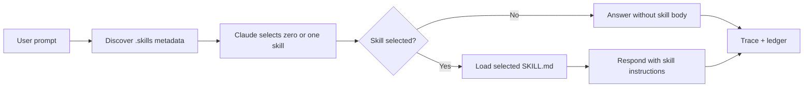

# Vel Code

```text
 __      ______
 \ \    / / ___|   Vel Code
  \ \  / / |       Agent Skills CLI
   \ \/ /| |___    Genie Wish Demo
    \__/  \____|
```

> A small Claude Sonnet Node.js CLI that demonstrates metadata-first skill routing.

Vel Code is intentionally small: it discovers installed skill metadata, asks Claude Sonnet whether one skill should activate, loads only the selected skill body, and keeps generated skills out of runtime discovery until explicit install.

## Reviewer Start

```bash
npm install
cp .env.example .env
npm start
```

Add `ANTHROPIC_API_KEY` to `.env` before live Claude runs. The CLI also reads an already-exported shell variable.

The first screen offers numbered reviewer prompts:

| Number | Prompt | Expected result |
|---:|---|---|
| `1` | `I'm new to this project, what should I do?` | Activates `welcome-me` and prints the required welcome header. |
| `2` | `what's the weather?` | Activates no skill and loads no skill body |
| `3` | `Review fixtures/review/broken-welcome-me/SKILL.md` | Reads that fixture as bounded local file context |

Direct one-shot smoke tests:

```bash
npm run start -- "I'm new to this project, what should I do?"
npm run start -- "what's the weather?" --trace
npm run start -- "Review fixtures/review/broken-welcome-me/SKILL.md" --trace
```

Use `--mock` only for offline diagnostics. The primary reviewer path is live Claude.

## Capability Fit

| Requirement | Implementation |
|---|---|
| Node.js CLI powered by Claude Sonnet | `npm start` and `npm run start -- "<prompt>"` route through `@anthropic-ai/sdk` unless `--mock` is explicit. |
| Implements Agent Skills core lifecycle | Startup reads metadata only; full `SKILL.md` body loads after activation. |
| Includes `welcome-me` | `.skills/welcome-me/SKILL.md` contains and enforces the required header. |
| Includes two registry skills | `skill-creator` and `receiving-code-review` are installed under `.skills/`. |
| Weather prompt does not load welcome skill | Trace shows no activation and zero activated skill-body estimate. |
| Project notes | See [`PROJECT_NOTES.md`](PROJECT_NOTES.md). |

## Skill Lifecycle



Generated skills live in `.generated-skills/` and are not active until explicitly installed:

```bash
npm run skills:draft -- "Create a skill for reviewing small TypeScript files"
npm run skills:install
```

Install requires a valid `SKILL.md` plus trigger evals with at least one positive and one negative case.

## Proof Gates

```bash
npm run readiness:check
npm run check
npm run skills:doctor
npm run skills:eval
```

What these prove:

| Command | Purpose |
|---|---|
| `npm run readiness:check` | Deterministic readiness check for core routing and lifecycle behavior. |
| `npm run check` | TypeScript typecheck plus Vitest suite. |
| `npm run skills:doctor` | Active skill diagnostics and generated-skill policy checks. |
| `npm run skills:eval` | Trigger evals for installed skills. |

Deterministic checks do not spend Claude tokens. Live reviewer prompts do.

## Trace And Audit

Add `--trace` to direct prompt mode:

```bash
npm run start -- "what's the weather?" --trace
```

Trace output includes:

- selected model and timing fields,
- active catalog count,
- full skill bodies read before activation,
- loaded unrelated skill bodies,
- local file context counts,
- local token estimates,
- Anthropic token usage when returned by live API calls.

Runtime usage events append to `.skill-usage/ledger.jsonl`. The file is intentionally present but should be empty for handoff.

## Repo Map

| Path | Purpose |
|---|---|
| [`app/src/agent/`](app/src/agent) | Selection, response, providers, token audit, and postconditions. |
| [`app/src/skills/`](app/src/skills) | Skill parsing, discovery, validation, evals, install gates. |
| [`.skills/`](.skills) | Active skill catalog. |
| [`.generated-skills/`](.generated-skills) | Draft skills, excluded from normal startup. |
| [`fixtures/review/broken-welcome-me/SKILL.md`](fixtures/review/broken-welcome-me/SKILL.md) | Concrete flawed file for bounded review demo. |
| [`docs/ARCHITECTURE.md`](docs/ARCHITECTURE.md) | Runtime flow and progressive disclosure detail. |
| [`docs/TEST_MATRIX.md`](docs/TEST_MATRIX.md) | Requirement-to-test coverage. |
| [`docs/IMPLEMENTATION_NOTES.md`](docs/IMPLEMENTATION_NOTES.md) | Human-readable rationale and review lens. |
| [`docs/PUBLISH_CLEANUP.md`](docs/PUBLISH_CLEANUP.md) | Publish cleanup notes. |
